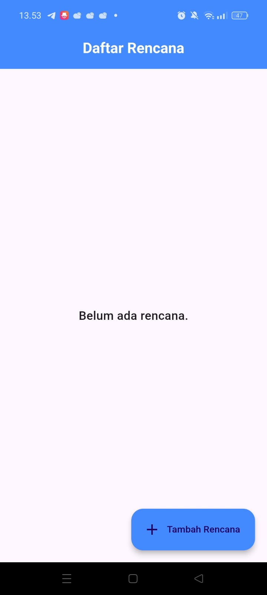
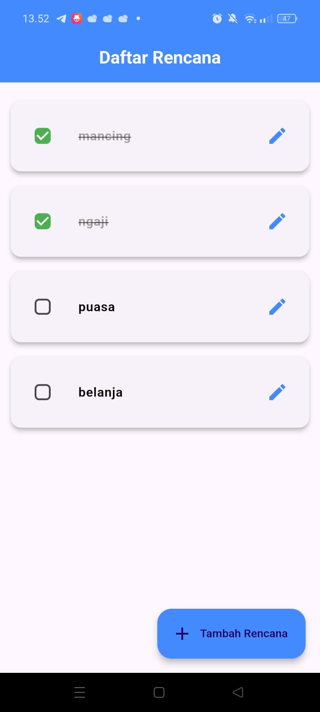

Master Plan 2

Master Plan 2 adalah aplikasi manajemen rencana yang dikembangkan menggunakan Flutter dengan pendekatan State Management menggunakan Provider. Aplikasi ini memungkinkan pengguna untuk menambahkan, mengedit, dan menandai rencana sebagai selesai dengan tampilan UI yang intuitif dan responsif.

Fitur Utama
-Menampilkan daftar rencana dengan tampilan yang bersih dan modern.
-Menambahkan rencana baru dengan satu klik tombol tambah.
-Edit rencana melalui bottom sheet modal yang mempermudah pengubahan nama rencana.
-Checkbox untuk menyelesaikan rencana dengan efek garis coret pada rencana yang sudah selesai.
-State Management menggunakan Provider untuk memastikan data selalu sinkron dan terupdate secara real-time.

Teknologi yang Digunakan

Flutter (Framework utama)

Dart (Bahasa pemrograman)

Provider (State management)

Struktur Folder

master_plan2/
│── lib/
│   ├── main.dart                 # Entry point aplikasi
│   ├── screens/
│   │   ├── plan_screen.dart       # UI utama aplikasi
│   ├── models/
│   │   ├── plan.dart              # Model untuk rencana
│   │   ├── task.dart              # Model untuk tugas dalam rencana
│   ├── providers/
│   │   ├── plan_provider.dart     # Provider untuk mengelola state aplikasi
│   ├── widgets/
│   │   ├── plan_tile.dart         # Widget untuk menampilkan item daftar rencana
│── pubspec.yaml                   # File konfigurasi dependencies

Cara Menjalankan Aplikasi

Pastikan Flutter telah terinstal di perangkat Anda.
Clone repository ini atau pindahkan kode ke direktori proyek Flutter Anda.
Jalankan perintah berikut di terminal:

flutter pub get
flutter run

Screenshot Aplikasi

### **Halaman Utama**

Tampilan ketika sudah diisi rencana =

PRAKTIKUM 1 

Langkah 4 : 

Kode berikut mendefinisikan kelas DataLayer, yang berfungsi sebagai lapisan penyimpanan data sementara dalam aplikasi:

Penjelasan Kode : 
import 'plan.dart';

class DataLayer {
  List<Plan> plans = [
    Plan(name: "Latihan Flutter"),
    Plan(name: "Belajar State Management"),
  ];
}

1.Mengimpor plan.dart

import 'plan.dart';

Ini menunjukkan bahwa ada file plan.dart, yang kemungkinan besar berisi definisi kelas Plan.
Kelas Plan ini kemungkinan memiliki atribut seperti name dan mungkin juga status seperti isCompleted.

2.Mendeklarasikan Kelas DataLayer

class DataLayer {
DataLayer bertindak sebagai lapisan penyimpanan data untuk aplikasi.
Data yang disimpan di sini berupa daftar rencana (plans).

3.Membuat List plans

List<Plan> plans = [
  Plan(name: "Latihan Flutter"),
  Plan(name: "Belajar State Management"),
];

-plans adalah list yang berisi beberapa objek Plan.
-Setiap objek Plan memiliki properti name, yang didefinisikan dalam plan.dart.
-Dua data awal dimasukkan:
 *"Latihan Flutter"
 *"Belajar State Management"
-Ini bisa dianggap sebagai dummy data atau data awal sebelum pengguna menambahkan data baru.

-Mengapa Dilakukan Demikian?

1.Untuk Menyediakan Data Awal

-Saat aplikasi pertama kali dijalankan, sudah ada beberapa rencana sehingga tampilan tidak kosong.
-Hal ini mempermudah pengujian tampilan tanpa harus selalu menambahkan data secara manual.

2.Memisahkan Data dan Logika Bisnis

-DataLayer bertindak sebagai lapisan model/data dalam aplikasi, sehingga logika tampilan (UI) tidak bercampur dengan logika data.
-Ini mendukung prinsip separation of concerns (pemisahan tanggung jawab), sehingga kode lebih terorganisir.

3.Mempermudah Implementasi State Management

-Nantinya, daftar plans bisa diubah dan diperbarui melalui state management (misalnya, menggunakan Provider atau setState).
-Data dalam DataLayer bisa digunakan oleh UI untuk ditampilkan atau diubah berdasarkan aksi pengguna.

Kesimpulan
Kode ini berfungsi sebagai tempat penyimpanan sementara daftar rencana dalam aplikasi. Dengan pendekatan ini, data mudah dikelola dan dipisahkan dari logika tampilan, sehingga aplikasi lebih modular dan mudah dikembangkan.

VARIABEL PLAN DI-LANGKAH 6?
Variabel plan dalam plan_screen.dart diperlukan untuk menyimpan data rencana (plan) tertentu yang sedang ditampilkan atau diedit oleh pengguna.

*Penjelasan*
Di dalam aplikasi, layar plan_screen.dart kemungkinan berfungsi untuk menampilkan detail dari satu rencana (Plan), seperti:
-Nama rencana
-Status (apakah sudah selesai atau belum)
-Daftar tugas dalam rencana

Sehingga dalam kode plan_screen.dart, biasanya ada variabel seperti ini:

final Plan plan;

atau

class PlanScreen extends StatelessWidget {
  final Plan plan;

  PlanScreen({required this.plan});
  
  @override
  Widget build(BuildContext context) {
    return Scaffold(
      appBar: AppBar(title: Text(plan.name)),  // Menggunakan plan di UI
      body: Center(child: Text('Detail dari: ${plan.name}')),
    );
  }
}

*Mengapa Variabel plan Diperlukan?*

1.Untuk Menampilkan Detail Rencana

-Saat pengguna memilih rencana dari daftar, kita harus tahu rencana mana yang dipilih agar bisa ditampilkan di layar.
-Variabel plan menyimpan data yang akan ditampilkan.

2.Untuk Mengubah atau Mengupdate Rencana

-Jika pengguna bisa mengedit rencana, kita perlu mengetahui rencana mana yang sedang diedit.
-Dengan menyimpan plan, kita bisa memperbarui rencana tersebut saat pengguna menyimpan perubahan.

3.Untuk Menghubungkan dengan State Management

-Jika aplikasi menggunakan state management, plan ini bisa digunakan untuk memperbarui state di dalam Provider, setState, atau metode lainnya.

*Kesimpulan*

Variabel plan dalam plan_screen.dart sangat penting karena:

1.Menyimpan rencana yang sedang ditampilkan
2.Mempermudah pengeditan data
3.Memungkinkan pembaruan data yang sesuai dalam state management

*Tanpa variabel plan, aplikasi tidak akan tahu rencana mana yang sedang ditampilkan atau diedit, sehingga tampilan tidak bisa berubah secara dinamis.

*LALU APA KEGUNAAN METHOD PADA LANGKAH 11 DAN 13  DALAM LIFECYCLE STATE?*

Penjelasan Kegunaan Method pada Langkah 11 dan Langkah 13 dalam Lifecycle State
*Langkah 11: initState() → Menambahkan Scroll Listener
Kode:
@override
void initState() {
  super.initState();
  scrollController = ScrollController()
    ..addListener(() {
      FocusScope.of(context).requestFocus(FocusNode());
    });
}

Kegunaan:
1.Inisialisasi Scroll Controller

-Method initState() dipanggil saat widget pertama kali dibuat.
-Dalam langkah ini, kita membuat objek scrollController untuk mengontrol perilaku scrolling.

2.Menambahkan Listener pada Scroll Controller

-Menggunakan ..addListener(() { ... }), kita menambahkan event listener pada scrollController.
-Listener ini akan dijalankan setiap kali pengguna menggulir layar.

3.Menyembunyikan Keyboard Saat Scroll

-FocusScope.of(context).requestFocus(FocusNode()); berfungsi untuk menghilangkan fokus dari input field ketika pengguna melakukan scroll.
-Artinya, jika pengguna sedang mengetik di TextField dan kemudian menggulir layar, keyboard akan otomatis tertutup.

*Langkah 13: dispose() → Membersihkan Sumber Daya
Kode:
@override
void dispose() {
  scrollController.dispose();
  super.dispose();
}

Kegunaan:
1.Membersihkan scrollController

-scrollController.dispose(); digunakan untuk melepaskan resource yang digunakan oleh scrollController.
-Ini penting untuk mencegah memory leak, terutama jika widget ini akan dihapus dan dibuat ulang.

2.Memastikan Lifecycle yang Benar

-super.dispose(); dipanggil untuk memastikan bahwa dispose() dari superclass (State) juga dieksekusi.
-Ini merupakan praktik standar dalam Flutter untuk mencegah error.

Kesimpulan:
-Langkah 11 (initState())
-Menyiapkan scrollController dan menambahkan listener untuk menutup keyboard saat pengguna menggulir layar.
-Langkah 13 (dispose())
-Membersihkan scrollController ketika widget tidak lagi digunakan, menghindari memory leak.

*Lifecycle ini penting untuk memastikan bahwa aplikasi berjalan efisien, tidak ada sumber daya yang boros, dan tidak ada error akibat objek yang belum dibersihkan.